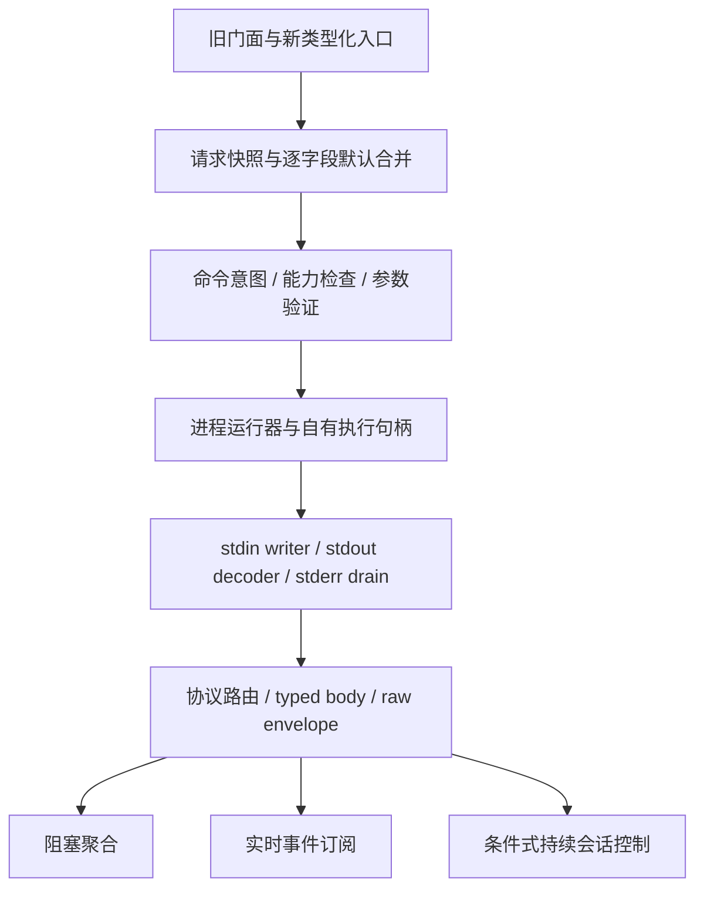

# claudecode-java-sdk：Claude 官方 CLI 能力对齐与补充方案

**版本：V1.0 · 研究日期：2026-09-20 · 状态：待评审的文档方案，未实施**

适用仓库：`easy-4-java/claudecode-java-sdk`。适用分支：`feature/1.0.x`、`feature/2.0.x`、`feature/3.0.x`。

## 1. 结论与交付边界

**下一步不应继续单纯堆积 `printWithXXX()`，而应先修复数据契约和命令语义，再建立真正的流式执行与会话控制。**

现有项目已覆盖不少 CLI 命令并保留原始参数调用入口。主要问题不是命令数量太少，而是部分入口没有兑现名称表达的能力、不同门面的默认配置不一致，以及测试把信息丢失固化为正确行为。[S01](sources.md#s01) [S05](sources.md#s05) [S07](sources.md#s07) [S12](sources.md#s12)

| 层级 | 支持的含义 | 下一步定位 |
|---|---|---|
| CLI 参数封装 | 能生成参数并启动进程 | 保留、修正、补充类型化管理入口 |
| CLI 运行与消息协议 | 持续读写、解析事件、保留结果、取消和清理 | 优先完善的核心能力 |
| 官方 Agent SDK 程序化控制 | 工具审批、交互提问、Hook 回调、自定义工具 | 分阶段适配；须确认底层协议与版本，不能靠同名参数宣称支持 |

本项目是第三方 Java CLI 适配层，不自动具备官方 Python/TypeScript SDK 的全部能力。[D03](sources.md#d03) [D09](sources.md#d09) [D25](sources.md#d25)

本变更只交付分析、设计与 OpenSpec 规范，不修改 Java 实现。文档内拟议接口不是现成 API；尚未运行的真实 Claude、Maven、CodeGraph 或 OpenSpec 官方验证不记为通过。文档的提交发布与功能实现是两种不同状态。

## 2. 核对基线与证据强度

| 分支 | 固定提交 | Java | JSON 基线 | 构建基线 |
|---|---|---:|---|---|
| `feature/1.0.x` | `3d0fe8d669be527a8ae036f62bdfbde74970d22b` | 8 | Jackson 2 | Maven 3 |
| `feature/2.0.x` | `c717b0b2d475ac4594e44226d6a4bf52bca96b14` | 17 | Jackson 2 | Maven 3 |
| `feature/3.0.x` | `691b3ae61c059187b20d78faf099c231d3e07a39` | 21 | Jackson 3 | Maven 4 |

来源：[S09](sources.md#s09) [S13](sources.md#s13) [S14](sources.md#s14) [S15](sources.md#s15)。机器可读版本见 [compatibility-baseline.json](compatibility-baseline.json)。

命令构建、配置、消息模型和结果模型在三线共有；客户端主要区别是 Jackson 导入，执行器主要区别是 Java 8 的 UTF-8 API 适配。共享问题应同步修复，但静态一致不等于三个环境测试通过。

本文区分：静态确认、协议风险待实测、已有低层入口但缺少高层契约、拟议新增。官方页面是查阅日滚动资料，不是用户实际 CLI 版本的证明。

## 3. 先修复的正确性问题

### F01 · 最终结果、费用和 usage 在解析链中丢失｜P0｜静态确认

```text
原始 result JSON
    → ClaudeMessage（没有 result / total_cost_usd / usage）
    → 忽略未知字段
    → findResult：convertValue(ClaudeMessage, ClaudeResult)
    → 已丢失字段无法恢复
```

现有 `shouldPrintStreamJsonAndParseReturnFinalResult` 明确断言最终正文和费用为 null。需要将其改为缺陷回归，而不是保留错误作为兼容承诺。[S01](sources.md#s01) [S03](sources.md#s03) [S07](sources.md#s07)

补充方案：先读原始 JSON 树，按 type/subtype 分派；result 从原始节点独立解析，保留完整 envelope。旧通用消息只是兼容投影，不再作为无损数据源。正文缺失、业务失败和结果缺帧分别表达，禁止以成功空正文掩盖问题。

验收：正文 final、费用、usage 逐字段一致；未知扩展可读；缺帧和损坏帧可诊断；持续会话按 turn 保留每个结果，不只保留最后一个全局结果。

### F02 · 通用消息与嵌套 assistant envelope 不一致｜P0｜协议风险待实测

`ClaudeMessage.message` 是 String，测试采用简化字符串消息。官方流模型包含完整消息对象与增量事件，无法用一个根级字符串概括。[S03](sources.md#s03) [S07](sources.md#s07) [D04](sources.md#d04)

补充方案：envelope 元数据和 body 分离；assistant/user 嵌套消息、stream_event 增量 body、system 子类型及 result 分开解析。工具调用和结果首先按内容块处理，不假定全是顶层事件。未知类型进入 UnknownEvent 并保留 raw；宽松模式也输出解析问题清单。Jackson 2/3 的实际行为以真实结构夹具分别验证，不把静态核对冒充复现。

### F03 · 缓存 token 字段错误，结果模型不完整｜P0｜静态确认

当前映射为 `cache_creation_tokens`、`cache_read_tokens`；官方字段是 `cache_creation_input_tokens`、`cache_read_input_tokens`。[S06](sources.md#s06) [D07](sources.md#d07)

按规范字段解析，旧名仅作输入别名；缺失与 0 区分。增加可选结构化输出、业务状态、错误详情、轮次和耗时；未确认字段保留为扩展，不伪造默认值。费用为估算，不是结算账本。持续输入还须区分累计结果和本轮增量，记录计量范围与重置边界，不能求每轮累计值之和。

### F04 · PrintOptions 能生成官方拒绝的组合｜P0｜静态确认

`toArgs()` 无条件加入 `-p`，之后还能加入 `--bg` 和云相关参数。官方禁止 `-p` 与 `--bg` 组合；云任务创建和向既有云会话追加消息也不是同一模式。[S04](sources.md#s04) [D01](sources.md#d01) [D20](sources.md#d20)

拆分命令意图：本地 print、后台派发、新云任务、既有云会话追加、自托管派发、管理命令、交互终端和常驻服务。不得笼统认为所有云参数都与 -p 冲突；既有 session 追加、自托管 environment 派发需按自身官方契约判断。显式 `--exec` shell 内容的风险也不能套用普通 argv 安全论断。[D20](sources.md#d20) [D22](sources.md#d22)

验收：非法组合在 spawn 前失败；合法追加和自托管场景有正例；错误列出冲突字段，绝不静默移除权限或任务模式。

### F05 · 默认配置不一致，可能遗漏调用方约束｜P0｜静态确认

`print(prompt, model)` 新建选项只设置 model；部分流式/JSON 快捷入口直达底层 CLI，没有一致继承客户端权限、工具、预算、提示词默认值。执行器的 executable/environment 仍生效，不能误写成所有配置失效。[S05](sources.md#s05)

`defaultPrintOptions()` 仅在 partial 为 true 时赋值，但 PrintOptions 默认 true，因此显式 false 不能关闭。[S01](sources.md#s01) [S08](sources.md#s08)

统一高层合并：SDK default → client default → invocation explicit override。显式 false、空集合和 `tools=""` 不是未设置。请求对象记录显式赋值；旧完整 PrintOptions 保留清晰的低层语义。验收模型覆盖不丢权限、工具、预算，false 真正生效，各高层输出入口一致。

### F06 · 细节参数编码缺少契约测试｜P0/P1｜静态确认与版本验证并存

过滤 debug 目前用两个参数输出，官方要求绑定形式；`tmux("classic")` 的 builder 路径丢失 classic，而便利方法编码不同。[S04](sources.md#s04) [S12](sources.md#s12) [D01](sources.md#d01)

增加逐 token golden tests、tmux/worktree 组合检查、schema 的结构化结果契约，以及 stream-json 快捷入口的官方推荐组合和版本验证。无实测时不声称所有历史版本必然失败。

## 4. 补齐真正的运行能力

### F07 · 实时输出，而非退出后解析｜P1｜静态确认

执行器全量缓存 stdout/stderr 后返回，客户端随后拆行；方法名的 StreamJson 当前表示格式，不表示运行时可见事件。[S02](sources.md#s02) [S05](sources.md#s05)

增加回调/订阅和可取消句柄，持续读取 stdout，独立排空 stderr，增量 UTF-8 解码覆盖跨字节边界，按运行序号有序投递。旧阻塞接口基于同一引擎聚合。增量与完整消息不能重复追加正文。[D04](sources.md#d04)

事件队列、单帧、raw 输出及诊断均有容量；慢消费者采用明确期限或取消，不无限扩容，不静默丢 result。可选磁盘暂存必须有配额、访问控制和清理。

### F08 · 持续 stdin 与托管会话｜P1/P2

`executeWithStdin(String, …)` 一次性写入后关闭输入；`printBidirectional(prompt)` 只是选择格式，没有持续写入通道。此前把它描述为完整双向流是不准确的。[S02](sources.md#s02) [S05](sources.md#s05)

先建立明确的一次性 stdin API，再增加持续句柄、顺序发送、多轮结果、半关闭、取消和 close。持续输入与单次调用的区别是验收条件。[D05](sources.md#d05)

session ID 不等于进程句柄；`--resume` 创建新运行和原进程多轮输入是两条路径，不应全局隐式复用当前 session。[D08](sources.md#d08)

### F09 · cwd、探测期限、取消与资源释放｜P1

执行器未显式设置 cwd；probe 沿用普通执行超时而不使用专属探测超时；Client.close 当前为空，不能承诺终止进行中的任务。[S01](sources.md#s01) [S02](sources.md#s02) [S08](sources.md#s08)

增加每调用 cwd/env 快照、启动/运行/排空期限、取消 token、并发上限与句柄。add-dir 是额外目录访问，不是 cwd；worktree 不等于系统级沙箱。

清理按资源所有权进行：正常结束/结束输入 → 限时等待 → 平台支持的升级终止 → 结束流泵与任务。close 幂等。Java 8、Windows、POSIX 进程树控制分别实现与测试，不承诺未验证平台零残留。[D18](sources.md#d18) [D28](sources.md#d28)

### F10 · 传输、协议与业务结果分离｜P1

分别暴露实际退出码、终止原因、协议完整性、业务状态、可选结果、解析诊断、初始化依赖状态和受控 raw。启动失败、超时和取消不只能共用 -1。

管理命令不需要 Agent result；Agent 流缺必要 result 不能算完整成功；持续会话某轮 result 不代表进程退出。依赖加载失败按调用方声明的必需/可选项处理，而非一刀切。[D02](sources.md#d02)

## 5. 在已有基础上补充类型化命令

现有 execute、mcp、plugin 等 raw 入口能调用部分能力；缺少的主要是验证、作用域、错误分类和稳定对象，不是完全无法调用。[S12](sources.md#s12)

| 能力域 | 补充方向 | 阶段 | 依据 |
|---|---|---|---|
| 结构化输出 | JSON/schema/structured result 与失败分类 | P0/P1 | [D06](sources.md#d06) |
| MCP | stdio/HTTP/JSON 配置、scope、env/header、参数分隔、认证状态 | P1 | [D12](sources.md#d12) |
| Plugin | 安装、卸载、启停、更新、校验、marketplace 与作用域 | P1/P2 | [D13](sources.md#d13) |
| Plugin eval | 独立评测请求，部分完成/失败/中断语义 | P2 | [D14](sources.md#d14) |
| Auth | 只读状态与显式登录分离，不自动改宿主认证 | P1 | [D16](sources.md#d16) |
| Session/Agent | 命名、恢复、分叉、列表、后台结果；attach 独立 | P1/P2 | [D08](sources.md#d08) [D21](sources.md#d21) |
| Remote Control | 会话选项与常驻 server 分离 | P2 | [D15](sources.md#d15) |
| Gateway/Runner | 自托管作用域、配置与可终止长进程 | P2 | [D22](sources.md#d22) |
| 配置导入 | 校正 importSessions 误名，提供新入口及弃用别名 | P1 | [D01](sources.md#d01) |
| Skills/Hooks | 配置加载与诊断，观察事件和控制决定分开 | P1/P2 | [D23](sources.md#d23) [D11](sources.md#d11) |

MCP WebSocket 不能凭空编码成 `--transport ws`，按官方 JSON 入口处理。SSE 与 HTTP 保留各自兼容状态。危险操作需要明确目标和范围，支持 dry-run 的先暴露预览；测试不得改真实用户全局配置。[D12](sources.md#d12)

## 6. Agent SDK 级扩展：有价值，但不得冒充现成功能

权限模式或 permission-prompt-tool 参数不等于 Java 审批回调。拟议审批模块关联 request/session/turn/tool，处理允许、拒绝、输入修改、用户提问、取消、超时和迟到响应；无处理器时不自动批准。

官方审批回调并不覆盖每次自动批准工具调用。完整工具审计应结合已验证事件或 Hook，不把审批回调当作全部执行的总拦截器。[D09](sources.md#d09) [D10](sources.md#d10)

先做配置层 Hook/MCP，再评估 Java 控制回调、自定义工具和进程内 MCP。观察 hook 或 tool_use 事件不是实现控制通道的证明。[D11](sources.md#d11) [D25](sources.md#d25)

检查点是条件式 P2：文件回退不是事务回滚或聊天历史回滚，不保证撤销 Bash/外部服务副作用。[D19](sources.md#d19)

门槛：固定官方 SDK/CLI 版本与控制协议证据，完成最小契约测试后开放。不能因为公开 API 有 interrupt 就臆造 wire JSON。本轮未验证该控制协议。

## 7. 技术组织与三分支兼容

初期保留单 Maven 模块，按职责拆分，而非急于拆多个发布物。



公共 API 不暴露某一 Jackson 主版本的 JsonNode；内部 codec 分别适配。公共最低能力以 Java 8 可实现接口为准；3.x 内部优化不得改变共同协议语义。

仅堆便利方法不能解决协议与生命周期；官方 SDK sidecar 虽可复用能力，却增加部署、依赖、认证与进程链。优先在原 Java CLI 适配器上补强，对未验证高阶控制采用能力门控。[技术设计](../../openspec/changes/align-claude-cli-official-contract/design.md)

## 8. 安全边界与运行默认值

安全配置不能因重载更换而丢失；不主动绕过权限；不在构造时登录、安装、更新 CLI；不隐式启动外部服务或删除资源。凭据、header、prompt、完整事件默认不进普通日志，诊断保留须限量、限期并控制可见性。

工作目录可能加载配置与 Hook，调用方明确选择可信目录、加载策略和隔离。bare 的认证与上下文语义不同，必须显式选用，不能由 SDK 静默补入；组织管理规则是外部权威。[D16](sources.md#d16) [D17](sources.md#d17) [D18](sources.md#d18) [D24](sources.md#d24)

失败后不自动重放可能已写文件、执行 shell 或调用外部工具的整轮请求。返回副作用不确定性，由调用方明确决定重试/续跑。

## 9. 实施顺序与门槛

| 阶段 | 必须完成 | 退出条件 |
|---|---|---|
| A 正确性 | F01–F06、真实结构夹具、修正错误 null 断言 | 三线离线契约一致，信息不丢，非法参数零进程启动 |
| B 可控执行 | 实时输出、stdin、cwd、专属 probe、有界缓存、取消清理 | 假进程证明实时性、期限和资源回收 |
| C 原生命令 | 结构化输出、MCP/Plugin/Auth/Session/后台类型化 | 精确 argv、负例、scope、版本证据 |
| D 条件式持续控制 | 多轮、审批、Hook、检查点及常驻服务 | 实际协议和平台验证满足门槛 |
| E 发布文档 | 兼容表、迁移说明、样例、三线 CI、安全验证 | 未验证项未误标完成，无虚假的全功能声明 |

每阶段先失败测试，再实现，再回归。实施任务全部保持未勾选。[验收矩阵](acceptance-matrix.md) [任务清单](../../openspec/changes/align-claude-cli-official-contract/tasks.md)

覆盖率配置存在不等于达标，某次 CI 成功不等于所有平台生命周期通过。README 的无测试/无 CI、3.x Maven 3 等遗留说明应按实际代码更新；制品是否发布另查发布系统。[S09](sources.md#s09) [S10](sources.md#s10) [S11](sources.md#s11) [S16](sources.md#s16)

## 10. 已确认与待验证

已确认：官方资料范围、固定源码基线、静态问题、优先级、目标行为和验收路径。

待验证：本机 CLI 版本、真实输出/退出行为、完整控制 wire schema、三线 Java 测试、Windows/POSIX 进程清理、依赖漏洞结果和 OpenSpec 官方严格校验。

本文件是可实施的补充规范，不是生产就绪认证。
