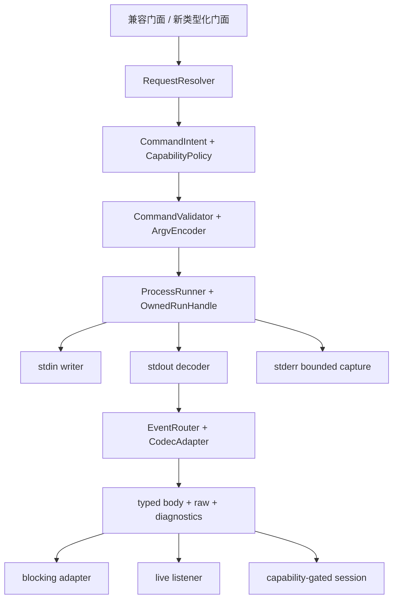

# Design: Claude CLI Java 运行与协议适配

状态：**待评审技术设计；所有新增类与接口名均为拟议名称，不是现有实现。**

## 1. 目标、非目标与现状

在三个版本线中建立语义正确、可观测、资源可控的 CLI 适配器。优先修复最终结果丢失、错误字段、非法组合、默认配置问题；不将本项目改为 HTTP SDK 或通用 Agent 平台。

现状为 `ClaudeCodeClient → ClaudeCodeCli → ClaudeCodeCliExecutor → Commons Exec → claude`。方法较多，但全量缓存后解析，stdin 预装字符串，常驻运行与控制消息缺少独立生命周期。[主报告 F01–F10](../../../docs/claude-cli/official-cli-alignment.zh-CN.md)

## 2. 路线选择

| 路线 | 优点 | 代价 | 决策 |
|---|---|---|---|
| 只补便利方法 | 改动小、便于 backport | 不解决协议、实时性、内存与配置漂移 | 只用于管理入口补齐 |
| 原 Java CLI 适配器补强 | 保持部署方式、控制运行资源、复用三线契约 | 维护消息兼容与平台适配 | 采用，先基础后条件式高阶 |
| 官方 SDK sidecar | 复用部分官方程序化接口 | 多一层依赖、进程、授权与部署 | 未来可选，不默认引入 |

## 3. 模块职责

先拆职责，不先拆发布物。初期保留单模块 JAR，职责包建议 command、protocol、runtime、session、management 与内部 json。



## 4. 拟议核心模型

| 类型 | 职责 | 非职责 |
|---|---|---|
| ClaudeRunRequest | 不可变意图/cwd/选项/期限/输入快照 | 不保存全局可变会话 |
| ClaudeCapabilities | 支持/不支持/未知/条件式与证据 | 不只看 help 做二元判断 |
| ClaudeRunHandle | run ID、完成等待、取消、close、自有资源 | 不拥有全部远程持久 session |
| ClaudeEvent | 运行序号、类型/子类型、关联、body/raw | 不把全部类型塞进单 DTO |
| ClaudeExecutionResult | OS/终止/协议/业务状态及诊断 | 不以一个 boolean 掩盖部分失败 |
| ClaudeSessionHandle | 持续 stdin、多轮、半关闭和条件式控制 | 不与 resume session ID 混同 |
| ClaudeManagementClient | 明确 scope 的类型化管理 | 不自动登录、安装、删资源 |

公共接口使用 Java 8 可实现的回调/完成句柄，不强制 Flow、virtual threads 或特定 Jackson JsonNode。SDK 自有 JSON value 或受控 raw 字符串均可，必须满足扩展不丢失。

## 5. 命令意图与参数验证

| 意图 | 构建原则 | 返回与生命周期 |
|---|---|---|
| LOCAL_PRINT | 显式格式、继承高层默认值 | 一次性或实时回调 |
| BACKGROUND_DISPATCH | 不强制 -p，shell exec 单列风险 | 派发结果和后台身份 |
| CLOUD_CREATE | 不混同既有 session 追加 | 云任务标识，不假设最终正文 |
| CLOUD_FOLLOWUP | 必须有目标 ID/URL，按契约允许 print | 追加/入队结果不是任务完成 |
| SELF_HOSTED_DISPATCH | environment/ref 按自托管契约 | 环境派发结果 |
| MANAGEMENT | 不加无关 Agent 参数 | 命令专属结果 |
| INTERACTIVE | 要求可用交互适配 | 缺 TTY 时明确不可用 |
| SERVER | 显式启动与终止策略 | 自有常驻句柄 |

验证顺序：静态字段 → 模式组合 → 实际 CLI 能力。安全参数不支持时拒绝，不静默移除。raw 是显式逃生入口，不承诺类型化语义。

可执行 path 和启动 argv 分离，避免 CommandLine.parse 误拆空格路径；启动前缀通过专门字段表达。类似 flag 的 prompt 按目标版本验证过的分隔或 stdin 策略传递，不能无证据声称放最后一定安全。

## 6. 配置合并与兼容

新高层入口：SDK defaults < client defaults < invocation explicit overrides。记录是否赋值，不根据基本类型默认值猜测。false、空字符串和空集合可以是有效值。

现有 print(prompt)、model/format 重载统一经 resolver，避免权限/工具默认值遗漏。旧 print(PrintOptions) 保留完整低层指定语义，增加明确非法组合校验；新 builder 默认继承，完全控制使用明确低层入口。旧 builder 无法表达显式赋值时用内部标记或新 builder，而非忽略空值。运行开始复制快照，执行中不继续读取可变 client config。

CLI managed/user/project 设置的权威顺序仍归 CLI；Java resolver 不是凌驾组织策略的权限引擎。

## 7. 消息、结果与计量

先解析每行原始 JSON，保留 envelope，再按 type/subtype 分派。result 直接映射，不经 ClaudeMessage。嵌套消息、内容块、增量、system 初始化/子类型分别建模。

缓存规范字段优先，旧别名仅兼容，冲突诊断；缺失不伪造成零。structured_output 与正文并列，本地映射失败、所需结构缺失、业务错误分开。

未知事件/字段保留；strict/lenient 均可见坏帧诊断；缺必要结果时标不完整。raw、展示正文、普通日志分离，敏感原文不默认进入遥测。

delta 与完整消息不能重复追加；费用按标识及计量范围处理。持续输入结果可能累计，记录重置点和原始数值，不能相加每轮累计。各 turn result 与 parent_tool_use_id 保留，不假设跨进程全局时序。

## 8. 进程生命周期

```text
NEW → VALIDATING → STARTING → RUNNING → DRAINING → TERMINAL
                         failure / cancellation → diagnostics
```

原子单终态处理取消/自然退出竞争。NORMAL_EXIT、START_FAILED、TIMEOUT、CANCELLED、IO_FAILED 独立于实际退出码；协议和业务状态另存。

stdin/stdout/stderr 独立处理，避免单流堵塞。一次性输入与持续输入不同；closeInput 只半关闭，不等于杀进程。probe 用自己的期限，不复用 run；server 不套有限 print 等待。

FIFO/单帧/raw/诊断限量。默认有期限等待，超限明确取消；可选 spool 有容量、权限和清理。raw 达阈值标截断，不能 trim 损坏原始字节。

清理顺序：正常结束/关闭输入 → 限时等待 → 支持平台升级终止 → 排空或取消流泵 → 收尾任务/临时文件。仅清理自有资源。Java 8/Windows/POSIX 进程树须独立 adapter 与测试；无法确认残留时警告，不虚报全清理。并发上限仅局部资源控制，不引入分布式调度。

## 9. 持续会话与高阶控制

先承诺真实流式输出和一次性 stdin；完整 SessionHandle 通过验证后再标支持持续模式。发送有本地关联 ID，写入串行，半关闭后拒绝新消息，每轮 result 与句柄终态分开。

本轮没有完整版本化控制 schema，设计只规定抽象、等待/取消与安全，不编造 wire JSON。后续固定官方 SDK/CLI 版本，验证能力协商、请求关联、interrupt 与取消后输出，再开放 adapter。未知能力不崩溃，init 前合法事件仍保留。

审批关联工具/session/turn，支持 allow/deny、受控输入修改、用户提问；无处理器/断连/超时不批准，迟到响应无效。观察 Hook 与控制 Hook 分开发布；文件回退不覆盖外部命令全部副作用。

## 10. 管理与安全

MCP/Plugin 使用明确 scope/config，stdio 正确分隔，header/env 脱敏，JSON 专用配置不伪造 transport。Auth status 只读，login/logout/setup-token 显式授权，秘密结果受控。

Remote Control server、gateway、runner 不走有限 print；无 TTY attach 明确失败。importSessions 作为弃用别名，新名表达配置导入。purge/强删/放弃未推送更改需明确目标与授权，支持 dry-run 则暴露预览。

bare/cwd/worktree/sandbox 各自建模，不能默认绕过组织权限，不删除安全参数兼容旧版，不自动重试有不确定副作用整轮。

## 11. 三线迁移与发布

共享协议、argv、默认合并和公共行为测试，分别跑 Java 8/17/21 最低环境。内部 codec 适配 Jackson 2/3，不做无审查全局包名替换，公共类型不暴露版本差异。

先一条线完成失败测试与实现，再 backport；提交历史可不同，验收语义必须一致。旧返回类型可投影新结果；非法组合被拒绝、默认配置恢复、null 变真实结果均须在迁移说明中明确，不藏入无关重构。

## 12. 验证与未决项

分离离线 codec/argv、假进程、真实 CLI、平台资源/安全、三线 CI。保留修复前后证据，不能继续以错误 null 断言证明正确。

实际支持 CLI 集合、控制 wire/capability、平台清理策略、容量默认值和不支持矩阵尚需验证；不阻止先修已确认静态缺陷，但阻止相应高阶能力被称为完成。完整追踪见 [验收矩阵](../../../docs/claude-cli/acceptance-matrix.md) 与 [任务](tasks.md)。
